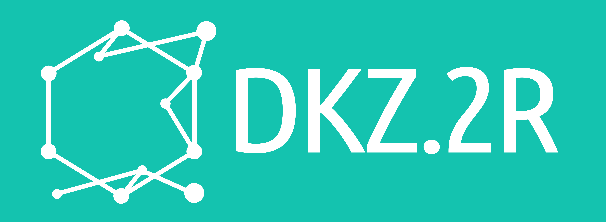

# Checklist Reviewer Toolkit

A toolkit for evidence-backed agentic assessment of scientific papers against structured checklists -- combining **data collection**, **review processes**, **human verification**, and **analysis**.

**Overview (toolkit purpose, components, demo):**  
[https://materials-data-science-and-informatics.github.io/checklist_reviewer/](https://materials-data-science-and-informatics.github.io/checklist_reviewer/)

On the webpage we explain what the project is about (scaling publications vs. manual review; trade-offs of pure LLM vs. agentic workflows), and describe the four pipeline stages, the **dynamic process designer** (node-based workflows, agents as composable tools, transparency and explainability), and **key capabilities**: choice of backbone models (e.g. local [Ollama](https://ollama.com/), remote [Google GenAI](https://ai.google.dev/), [LiteLLM](https://github.com/BerriAI/litellm)), external tools for claim verification and integrations, and a modular plug-and-play architecture. It also highlights presentation at the [HMC Conference 2026](https://helmholtz-metadaten.de/events/hmc-conference-2026).

This repository contains the runnable **web application** and **review workflow** implementation you can run locally.

---

## Authors

**Hamed Hemati** · **Alicia Janz** · **Stefan Sandfeld**  

Institute for Materials Data Science and Informatics (IAS-9), Forschungszentrum Jülich

---

## Repository structure


| Folder / file          | Purpose                                                                                                                                                     |
| ---------------------- | ----------------------------------------------------------------------------------------------------------------------------------------------------------- |
| `src/web/`             | Flask web application: UI modules (collections, checklist review, analysis, human verification, settings, workspace) including templates and static assets. |
| `src/review_workflow/` | The LLM pipeline: engines and components for pre-processing, evaluating (agents/tools), and post-processing papers.                                         |
| `src/core/`            | Foundational logic and tools: storage, task management, PDF processing, embeddings, and workspace management.                                               |
| `workspaces/`          | All user data (gitignored). Contains user profiles (e.g. `guest/`) with their collections, checklists, process definitions, and configs.                    |
| `app.py`               | Entry point: creates the Flask app and runs the dev server.                                                                                                 |


---

## How to run

**Python 3.11+** required.

### Option 1: uv (no manual install)

```bash
uv run app.py
```

`uv` creates a `.venv` and installs dependencies from `pyproject.toml`. The app is served at **[http://127.0.0.1:5555](http://127.0.0.1:5555)**.

### Option 2: pip

```bash
python -m venv .venv
source .venv/bin/activate   # Windows: .venv\Scripts\activate
pip install -r requirements.txt
python app.py
```

App runs at **[http://127.0.0.1:5555](http://127.0.0.1:5555)**.


---

## License

This project is licensed under the MIT License. See the [LICENSE](LICENSE) file for details.

---

## Acknowledgments

This toolkit is developed at the **Institute for Materials Data Science and Informatics (IAS-9)** of **Forschungszentrum Jülich** as part of the **[DKZ.2R](https://www.dkz2r.de)** project.

**[DKZ.2R](https://www.dkz2r.de)** is the Rhine-Ruhr Center for Scientific Data Literacy and one of Germany’s eleven data literacy centers. Further information: **[dkz2r.de](https://www.dkz2r.de)**.


| [](https://www.fz-juelich.de/en/ias/ias-9) | [](https://www.fz-juelich.de/en) | [](https://www.dkz2r.de) |
| :--: | :--: | :--: |

---

## Contributing

Contributions are welcome. Please fork the repository and open a pull request with your changes.

For questions or issues, please open an issue in this GitHub repository.